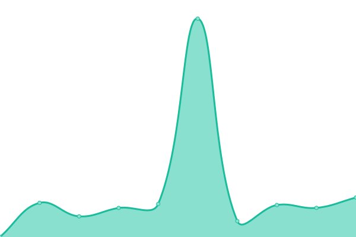

# [📈 Live Status](https://status.mylocal.gifts): <!--live status--> **🟩 All systems operational**

This repository contains the open-source uptime monitor and status page for
[MyLocal Gifts](https://about.mylocal.gifts), powered by
[Upptime](https://github.com/upptime/upptime).

[MyLocal Gifts](https://about.mylocal.gifts) is a network of shop local
marketplaces that bring independent businesses closer to their local community.

<!--start: status pages-->
<!-- This summary is generated by Upptime (https://github.com/upptime/upptime) -->
<!-- Do not edit this manually, your changes will be overwritten -->
<!-- prettier-ignore -->
| URL | Status | History | Response Time | Uptime |
| --- | ------ | ------- | ------------- | ------ |
|  [About MyLocal Gifts](https://about.mylocal.gifts) | 🟩 Up | [about-my-local-gifts.yml](https://github.com/wessex-digital-solutions/mylocal.gifts-status/commits/HEAD/history/about-my-local-gifts.yml) | 

 911ms
     
 | 

<a href="https://status.mylocal.gifts/history/about-my-local-gifts">100.00%</a>
    

|  [MyLocal Gifts Learning Hub](https://learn.mylocal.gifts) | 🟩 Up | [my-local-gifts-learning-hub.yml](https://github.com/wessex-digital-solutions/mylocal.gifts-status/commits/HEAD/history/my-local-gifts-learning-hub.yml) | 

 767ms
     
 | 

<a href="https://status.mylocal.gifts/history/my-local-gifts-learning-hub">100.00%</a>
    

|  [Wiltshire Gifts](https://www.wiltshiregifts.co.uk) | 🟩 Up | [wiltshire-gifts.yml](https://github.com/wessex-digital-solutions/mylocal.gifts-status/commits/HEAD/history/wiltshire-gifts.yml) | 

 791ms
     
 | 

<a href="https://status.mylocal.gifts/history/wiltshire-gifts">100.00%</a>
    

|  [Somerset Gifts](https://www.somersetgifts.co.uk) | 🟩 Up | [somerset-gifts.yml](https://github.com/wessex-digital-solutions/mylocal.gifts-status/commits/HEAD/history/somerset-gifts.yml) | 

 659ms
     
 | 

<a href="https://status.mylocal.gifts/history/somerset-gifts">100.00%</a>
    

|  [Hampshire Gifts](https://www.hampshiregifts.co.uk) | 🟩 Up | [hampshire-gifts.yml](https://github.com/wessex-digital-solutions/mylocal.gifts-status/commits/HEAD/history/hampshire-gifts.yml) | 

 209ms
     
 | 

<a href="https://status.mylocal.gifts/history/hampshire-gifts">100.00%</a>
    

|  [Gifts from Dorset](https://www.giftsfromdorset.co.uk) | 🟩 Up | [gifts-from-dorset.yml](https://github.com/wessex-digital-solutions/mylocal.gifts-status/commits/HEAD/history/gifts-from-dorset.yml) | 

 575ms
     
 | 

<a href="https://status.mylocal.gifts/history/gifts-from-dorset">100.00%</a>
    

|  [Gifts from Devon](https://www.giftsfromdevon.co.uk) | 🟩 Up | [gifts-from-devon.yml](https://github.com/wessex-digital-solutions/mylocal.gifts-status/commits/HEAD/history/gifts-from-devon.yml) | 

 666ms
     
 | 

<a href="https://status.mylocal.gifts/history/gifts-from-devon">99.87%</a>
    

<!--end: status pages-->

[**Visit our status website →**](https://status.mylocal.gifts)

## 📄 License

- Powered by: [Upptime](https://github.com/upptime/upptime)
- Code: [MIT](./LICENSE) © [Upptime](https://upptime.js.org)
- Data in the `./history` directory:
  [Open Database License](https://opendatacommons.org/licenses/odbl/1-0/)
